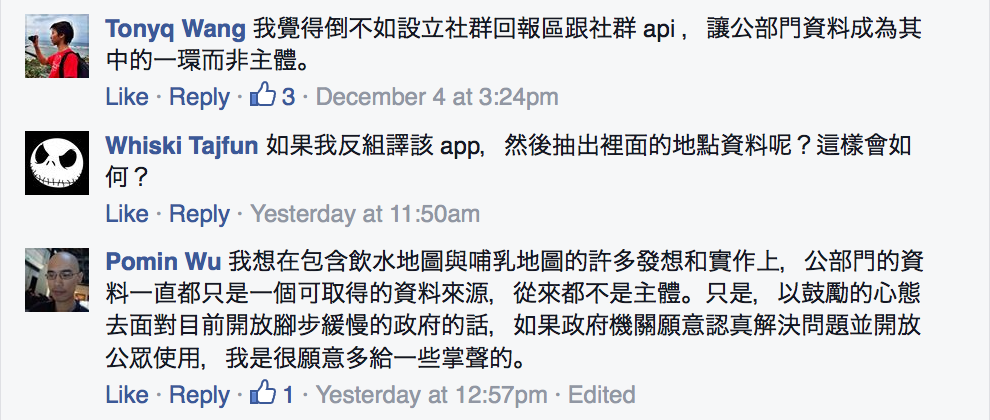
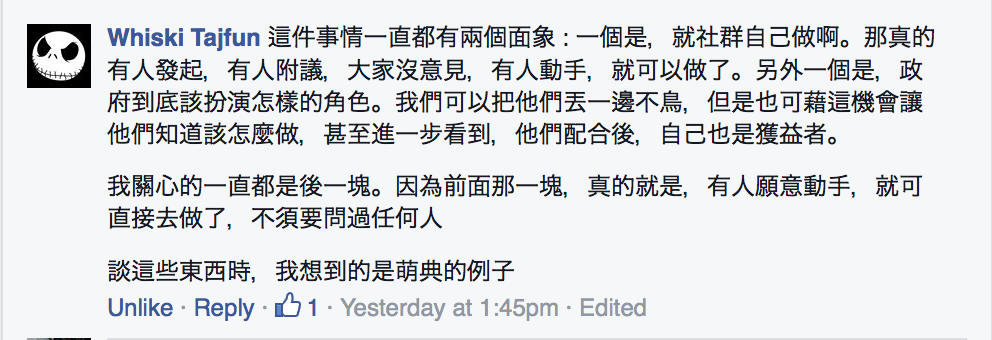
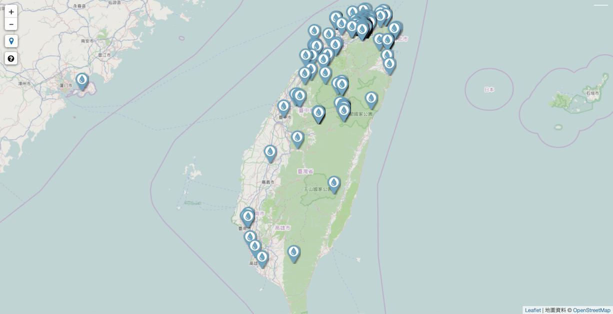
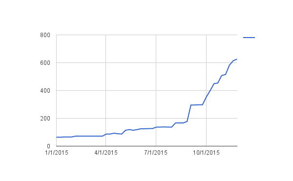

# 民眾、社群與 NGO 的協作

## 飲水地圖的經驗

[@pm5](https://twitter.com/pm5) / [Pomin Wu](https://www.facebook.com/pomin5)

## 關於我

<ul style="display: inherit;">
<li>吳柏旻 / pm5 / Pomin Wu</li>
<li>數學、寫程式</li>
<li>2002 年前後短暫參與 NGO 與開源軟體，後來跑去研究代數拓樸與攝影，2013 年重新投入 NGO 與開放文化工作。</li>
<li>台灣環境資訊協會 <a href="http://teia.tw/">http://teia.tw/</a></li>
<li>g0v 零時政府、開放街圖</li>
</ul>

# 社群是什麼？

https://www.facebook.com/groups/odtwn/permalink/1351814758166272/?comment_id=1380555501958864

# 社群

## 開放街圖

* 2013 年 [DrupalCamp Taipei](http://drupaltaiwan.org/)
* [台灣開放街圖社群](http://openstreetmap.tw/)
* 2013 年 [COSCUP](http://coscup.org/) 開源人年會
* 開源軟體、開放資料、開放文化

## 開放資料

* 台灣海岸守護網
* 2014 年[行政院 Open Geo Data for Government 咨詢會議](https://osmtw.hackpad.com/2014-07-27-Open-Geo-Data-for-Government-5YtEoKVphQF)
* 尼泊爾震災
* 鄧東波、Louis、李昕迪、蔡志展、衷嵐焜、陳瑞麟，還有許多人

## 社群

* [community](https://www.wordnik.com/words/community), n.
* *commūnitās*（followship、同盟、盟友）
* *commūnis*（common、共同）

## 群

* [群](https://www.moedict.tw/%E7%BE%A4)，名詞
* 「相聚一起的人或物。」

## 開源／開放文化社群

不同的人帶著不同的期待，因為某些交集而聚在一起。

## 交集

* 資料、程式
* 格式、授權、條文
* 貢獻、列名
* Data-centric thinking

# 非營利組織 非政府組織

## 台灣環境資訊協會

* 2001 年幫忙架電子報主機
* 資訊工程師
* 資訊公開、環境信託

## 資訊公開

* [環境資訊中心](http://e-info.org.tw/)

## 環境信託與守護

* 自然谷環境信託基地
* [地球日](http://www.earthday.org.tw/)
* [海岸守護網](http://coast.e-info.org.tw/)

## 組織

* [organization](https://www.wordnik.com/words/organization), n.
* *organum*（tool、instrument、工具）

## 組織

* [組織](https://www.moedict.tw/%E7%B5%84%E7%B9%94)，名詞
* 「一群人為達特定目標，經由一定的程序所組成的團體。」

## 組織

* 目標
* 程序
* Procedural thinking

# 兩種組合

以社團法人與開源社群為例

## 參與者

<h3 id="ngo">NGO</h2>
<ul>
<li>會員</li>
<li>理事、監事</li>
<li>秘書長</li>
<li>秘書處</li>
</ul>

<h3 id="社群">社群</h3>
<ul>
<li>（發起人）</li>
<li>（貢獻者）</li>
<li>（活躍成員）</li>
<li>路人</li>
</ul>

## 執行

<h3 id="ngo">NGO</h3>
<ul>
<li>相對的財務穩定</li>
<li>年度報告</li>
<li>期程</li>
<li>持續性的工作</li>
</ul>

<h3 id="社群">社群</h3>
<ul>
<li>誰在乎誰就去做</li>
<li>粗略的共識</li>
</ul>

## 行動

<h3 id="ngo">NGO</h3>

NGO 的成立宗旨，通常會被用來擬定行動的策略與計劃，然後選擇專案投注資源執行。

<h3 id="社群">社群</h3>

開源社群的發起目的與宗旨，或許應該被理解為一種「承諾」，也就是不違背宗旨的任何活動不會被排除在社群之外。

## 抗壓性

<h3 id="ngo">NGO</h3>

NGO 擅長說服、教育大眾。

<h3 id="社群">社群</h3>

社群喜歡讓小白被有用的訊息洗掉。

## 切入問題的角度

<h3 id="ngo">NGO</h3>
<ul>
<li>要跟哪些人協調？</li>
<li>要經過誰同意？</li>
<li>訊息導向</li>
<li>Procedural thinking</li>
</ul>

<h3 id="社群">社群</h3>
<ul>
<li>其它人可不可以運用？</li>
<li>有沒有正確給予 credit？</li>
<li>共識導向</li>
<li>Data-centric thinking</li>
</ul>

# 飲水地圖

2015 年 4 月發起，仍在進行中。

「一個600ml的瓶裝水，需要耗費600ml的6~7倍水量製造它的塑膠瓶！在缺水的時代來臨時，別再讓塑膠瓶跟我們搶水資源了！」

## 過程

* 發起人陳瑞賓
* 4/09，一日黑客松
* 4/17，第零次社群小聚
* 目前有 5 次小聚

## 參與者

* OpenStreetMap 社群的技術支援：yellowsoar、Supaplex
* 許多人一起討論推廣方案：貞寧、luke、chewei
* 校園推廣與標示飲水點資料：子琳
* 開發 Android App：佳慶、Yi-Hsuan Chuang
 主要在 [OpenStreetMap 台灣](https://www.facebook.com/groups/OpenStreetMap.TW/)臉書社團活動

## 資料、數據、現況

* http://beta.hackfoldr.org/drinking-water

# 進行中

可能有做對一些事情⋯⋯

## 多點接口，而不是單一窗口

儘可能讓組織裡的人直接面對社群

* 等待
* 瓶頸
* 參與感
* credit

## 從討論資料格式開始著手

* 底線
* 條文
* 路人皆可參與

## 平常就有人在混社群

* 人際網絡
* 貢獻
* 多點接口與 credit

## 定期辦實體小聚

* 持續性的工作

# 進行中

可能會弄錯一些事情⋯⋯

## 一口氣包裝太多概念

* 減少瓶裝水用量
* 節省水資源
* 開放資料
* 社群與 NGO 合作
* 群眾參與

## 有些外部需求來不及回應

* 廠商贊助
* 「何不做個 App」

## 外部贊助

將來可能會面對的

* 以什麼名義？
* 錢與資源匯流到哪裡？
* 贊助的條款是什麼？

## 還未真正接觸到所謂民眾

* 巿場考驗

## 民眾的結構

* 各有各的興趣
* 萬人響應，一人到場
* 一日球迷
* 社群可以對民眾做什麼？
* 組織可以對民眾做什麼？

# 感想

## 價值

* Tim O'Reilly, [Create more value than you capture](https://www.youtube.com/watch?v=njpGH_IHjFg)

## 穩定態

* 願景
* 台灣的開放文化社群

## 行動

* 維持動能
* 沒有哪種組合一定比較好

# 感謝聆聽

[@pm5](https://twitter.com/pm5) / [Pomin Wu](https://www.facebook.com/pomin5)
