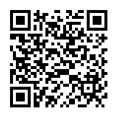
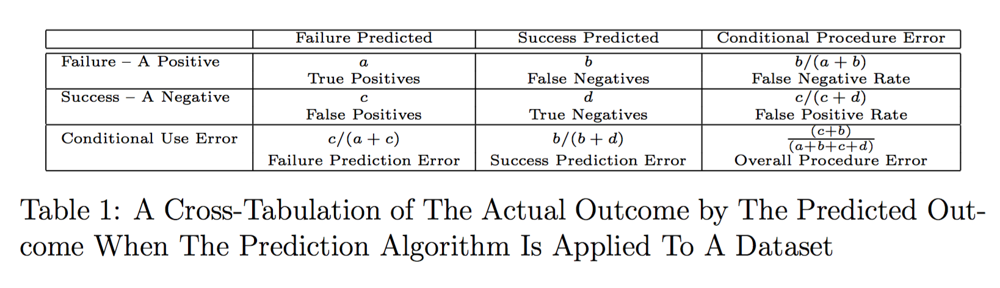
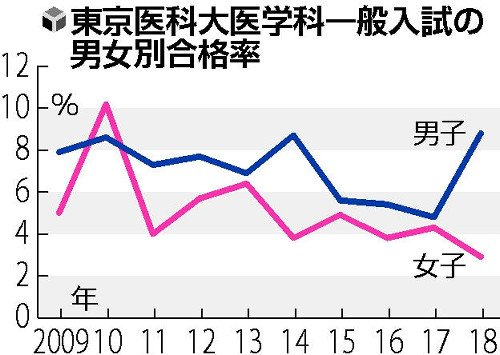
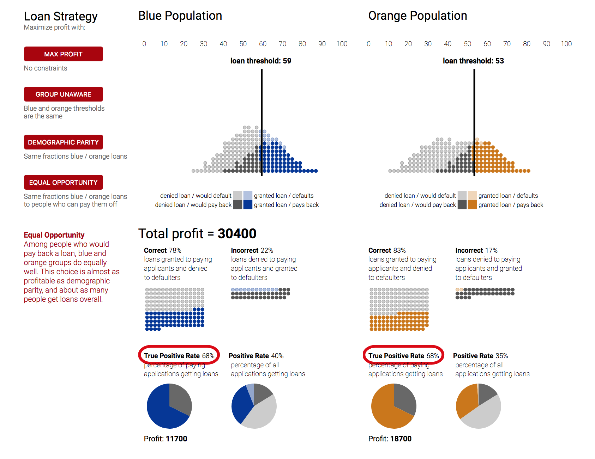
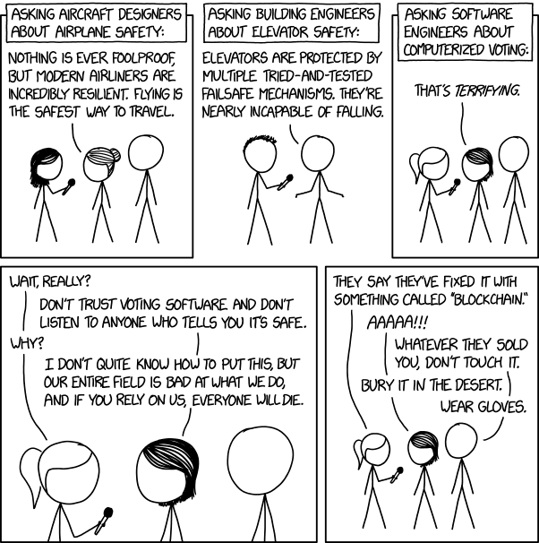

## Fairness and privacy issues in Machine Learning
### 從 Ethical AI 談機器學習的 隱私與公平性

Full slides at 
https://pm5.github.io/talks/2018-08-05-coscup-ai-ethics/

---

# Fairness
## 公平

## References

C. Dwork, M. Hardt, T. Pitassi, O. Reingold, and R. Zemel, “Fairness Through Awareness.” 2012.

R. Berk, H. Heidari, S. Jabbari, M. Kearns, and A. Roth, “Fairness in Criminal Justice Risk Assessments: The State of the Art.” 2017.

---

# It is difficult to be fair.
## 公平不容易

"Fairness throught blindness" is not good enough.

## Redundant encoding

Dwork et al. (2012)

For example: Redlining, "Gaydar".

Berk et al. (2017)

## Accuracy (in)equality

Berk et al. (2017)

Machines may magnify human prejudices in unexpected ways.

## Runaway feedback loops

D. Ensign, S. A. Friedler, S. Neville, C. Scheidegger, and S. Venkatasubramanian, “Runaway Feedback Loops in Predictive Policing.”  2017.

Business seeks to maximize profits.

## Self-fulfilling prophecy and reverse tokenism

Dwork et al. (2012)

## Fairness through awareness

Dwork et al. (2012)

---

# What does fairness mean?
## 什麼叫公平？

## Definitions

Berk et al. (2017)

* Group fairness
* Individual fairness
* Equal opportunity
* Counterfactual fairness, etc.

## Group fair: Statistical parity

$\frac{a+c}{a+b+c+d}$ and $\frac{b+d}{a+b+c+d}$ are the same for each group, where $a, b, c, d$ are the followings:

Berk et al. (2017)

例如：新加坡組屋（公共住宅）

> 新加坡政府認為組屋的族群人口數比例，必須要能反映實際族群人口比例，也就是新加坡整體人口。假設華人佔 75%、馬來人 15%、印度人 10%，那麼一棟組屋裡的各族群人數，也應該要差不多是這樣。

萬宗綸，《安娣，給我一份摻摻！》（2016），頁 70。

Removes redundant encoding, but inefficient.

Dwork et al. (2012)

## Individual fairness

For metrics $D$ of $A$ and $d$ of $V$, an algorithm $M:V\to\Delta(A)$ has **individual fairness** if it satisfies the following Lipschitz condition:

$$
D(M(x), M(y))\le d(x,y)
$$

Dwork et al. (2012)

大家一起考試，答案接近的人，通過考試的機率就接近。不能像東京醫科大學因為你是女生就扣你分。

https://twitter.com/livedoornews/status/1024791251407626240

## Equal opportunity

Consider supervised machine learning in binary cases.  Assume we have training data $(X,A,Y)$ where $A$ is the protected attribute.  We aim to train a prediction function $\widehat Y=f(X,A)$.  Then $\widehat Y$ satisfies **equal opportunity** with respect to $A$ and $Y$ if

$$
P(\widehat Y=1|A=0, Y=1) = P(\widehat Y=1|A=1, Y=1)
$$

M. Hardt, E. Price, and N. and Srebro, “Equality of Opportunity in Supervised Learning.” 2016.

Attacking discrimination with smarter machine learning

https://research.google.com/bigpicture/attacking-discrimination-in-ml/

---

# How to test it?
## 測試與檢驗

S. A. Seshia et al., “Formal Specification for Deep Neural Networks,” p. 10, May 2018.

A. Albarghouthi, L. D’Antoni, S. Drews, and A. V. Nori, “FairSquare: probabilistic verification of program fairness,” Proceedings of the ACM on Programming Languages, vol. 1, no. OOPSLA, pp. 1–30, Oct. 2017.

How to test equal opportunity？

---

# Some new problems
## 一些新問題

## Social conditions

G. Ramnarayan, “Equalizing Financial Impact in Supervised Learning.”  2018.

R. Binns, “Fairness in Machine Learning: Lessons from Political Philosophy.”  2017.

## Composition

C. Dwork and C. Ilvento, “Fairness Under Composition.”  2018.

## Delayed impact

L. T. Liu, S. Dean, E. Rolf, M. Simchowitz, and M. Hardt, “Delayed Impact of Fair Machine Learning.” 2018.

http://bair.berkeley.edu/blog/2018/05/17/delayed-impact/

---

# 隱私
## Privacy

## References

C. Dwork, “Differential Privacy.” 2006.

R. Shokri, M. Stronati, C. Song, and V. Shmatikov, “Membership Inference Attacks Against Machine Learning Models.” 2017.

---

# Differential privacy
## 差分隱私

## Impossibility of absolute disclosure prevention

**Dalenius desideratum**: access to a statistical database should not enable one to learn anything about an individual that could not be learned without access.

It is impossible to achieve Dalenius desideratum.  For example:

* My height is a piece of sensitive information.
* The database yields the average heights of people of different nationalities.
* An adversary knows "I am two inches shorter than the average."

Dwork (2006)

Newton: "Space is relative. (But I wont't admit it.)"

Einstein: "Time is relative."

Dwork: "Privacy is relative."

## Definition

Let $\mathcal{K}$ be a randomized function.   We say $\mathcal{K}$ satisfies **differential privacy** if for every datasets $D_1, D_2$ differing on at most one element, and for every $S\subset Range(\mathcal{K})$, there is

$$
\mathrm{Pr}[\mathcal{K}(D_1)\in S]\le e^{-\epsilon}\mathrm{Pr}[\mathcal{K}(D_2)\in S]
$$

for some $\epsilon$.

Dwork (2006)

Individual fairness is an extension to differential privacy.

$M: V\rightarrow\Delta(A)$ satisfies $\epsilon$-differential privacy if and only if $M$ satisfies the $(D_\infty, d)$-Lipschitz property, where, letting $x\Delta y$ denote the symmetric difference between $x$ and $y$, we define $d(x, y)$ to be $|x\Delta y|$.

## Differential privacy in deep learning

M. Abadi et al., “Deep Learning with Differential Privacy.” 2016.

C. Dwork and V. Feldman, “Privacy-preserving Prediction.” 2018.

---

# Membership inference attack

Given a piece of data and a model, determine if the data is in the training dataset of the model by black-box attack.

給一筆資料，一個 model，用黑箱攻擊看看這筆資料在不在 training data 中。

* It is possible to train a model to guess if the data is in the training dataset.
* It is possible to conduct black-box attack with shadow training.
* This attack exploits overfittings of the model.

Shokri et al. (2017)

---

# Final words
## 結語

### 科技社群如何參與科技政策規劃？ 你真的需要搞一個政黨出來嗎？

8/12 9:30 - 12:25 IB308

> 台灣在成為數位國家之前，首先必須要是一個法治國家。被視為國家發展救世主的數位科技，無法不受到嚴肅的監管，以避免公、私部門的濫權。政府應積極落實公民的隱私權保障，加速推動設置獨立且專責的資料保護監管機構。

鍾孝宇，〈發展數位國家，應同時保障公民隱私權〉（2017）

https://rocket.cafe/talks/82628

"I don't quite know how to put this, but our entire field is bad at what we do, and if you rely on us, everyone will die."

https://xkcd.com/2030/

---

## Thank you for your time
### 感謝

吳柏旻 Pomin Wu [@pm5](https://github.com/pm5)

Trustable AI https://trustable.ai/
