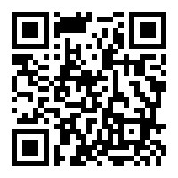

title: OGP Summit 分享會：公民科技 x 不實訊息 x 環境
author:
  name: Pomin Wu
  twitter: pm5
  url: https://github.com/pm5
output: index.html
controls: true

--

# OGP Summit 公民科技

--

# 

https://pm5.github.io/talks/2018-08-23-ogp-summit/

--

# Collecting intel on corrupt networks

--

* **Open**: Those that are freely available to the public, in an unredacted form, without charge.
* **Semi-open**: Those that are freely available to the public in an unredacted form, with charge.
* **Mediated**: Confidential information only available to authorised public bodies.  Disseminated in an edited and modified form through publicly available documentation.
* **Private**: Information that is only available to insiders

--

1. Identify points in the information landspace where corrupt networks are vulnerable to exposure.
2. Apply data-analytics to maximise yield.

--

Specifically in step 2:

- Scrape company house data, digitise it, so that it could be modelled to rapidly reveal relationships such as commercial affiliations and proxy owners.
- This results in a database where data can talk to each other.  We can then find out who a person is linked to, and if they or their affiliates have been identified in mediated sources.

--

# org-id.guide

## http://org-id.guide/

--

* http://opendataservices.coop/
* https://iatistandard.org/en/
* https://openownership.org/
* https://www.open-contracting.org/
* http://www.threesixtygiving.org/

--

Central to all these datasets are organizations.

--

* https://open-data-charter.gitbook.io/open-up-guide-using-open-data-to-combat-corruption/
* [Datasets in detail](https://airtable.com/shrHY9KFJ5bircwvx)

--

# Lobbying transparency

--

2014 年新的歐盟執委會上任時，承諾遊說活動要更透明，所以要公開他們與說客的會面。

過去 3 年半公佈了 20000 多筆記錄。Transparency International 對此做了資料分析。

--

他們發現，在 2000 多場遊說活動中，關於 Internet 的監管是遊說議題的最大宗，佔了 25%，並且其中九成是與商業公司、產業代表的會議，只有一成的會議來自消費者協會、非營利組織等公民社會的代表。

這表示我們未來對 Internet 的監管法律是可能受這些商業公司高度影響的。

--

--

* [政府挺旅館業 Airbnb恐被切網路IP](https://udn.com/news/story/7238/3287839)
* http://lobbyingtransparency.net/standards/integrity/
* http://ec.europa.eu/transparencyregister/public/homePage.do

