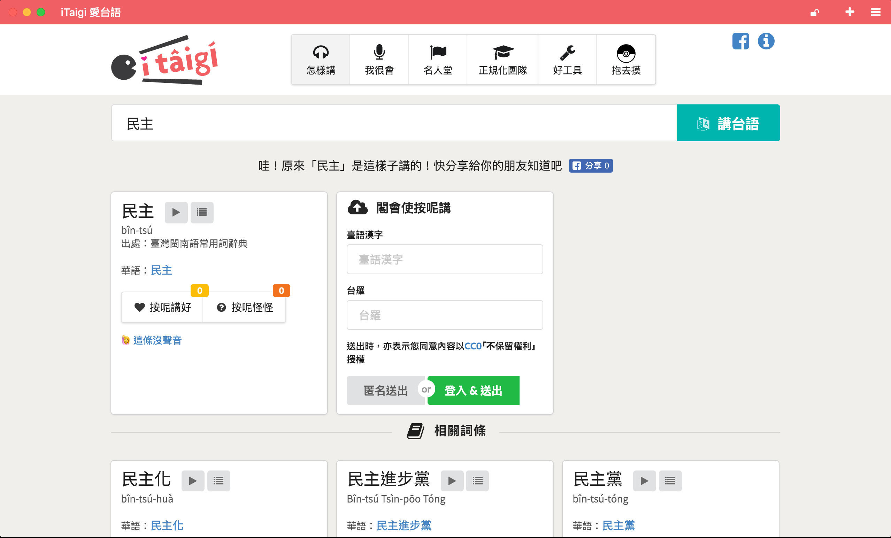
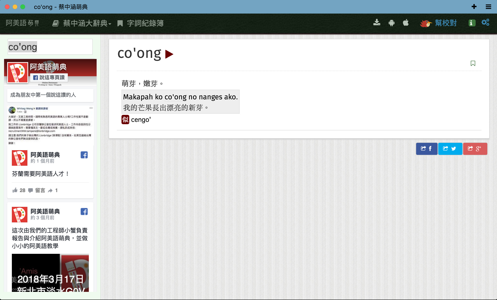

# Some comments on Vaidhyakarn's report

Pomin Wu (@pm5)

* Mathematics, Software development
* [g0v.tw](https://g0v.tw/) and [OpenStreetMap](https://osm.org/) community
* Worked in several NGOs as software engineer and Open Source / Open Data evangelist

[https://pm5.github.io/talks/2018-10-16-tfd-klaikong](https://pm5.github.io/talks/2018-10-16-tfd-klaikong)

# Inclusiveness

## Language

[http://itaigi.tw/k/民主](http://itaigi.tw/k/%E6%B0%91%E4%B8%BB)

[https://amis.moedict.tw/萌#:co'ong](https://amis.moedict.tw/%E8%90%8C#:co'ong)

## Southeast Asia

## Safe space

# Observations

We still have lots of work to do in Taiwan.

# Thank you
