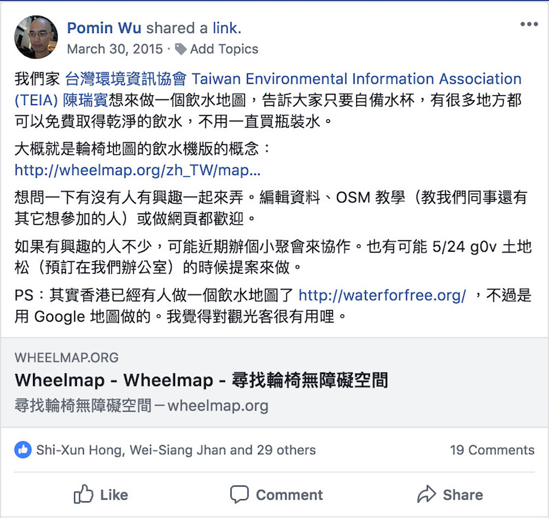

# OCF 公民科技交流計畫

跨領域合作如何可能？ 公民團體與開放資料的介接 -- 飲用水地圖計畫

[TOC]

---

## 我是誰

* 吳柏旻 Pomin Wu [pm5](https://twitter.com/pm5)
* 平常喜歡算數學、寫程式。
* 曾在[崔媽媽基金會](https://www.tmm.org.tw/)、[台灣環境資訊協會](https://teia.tw/)工作，導入開源軟體。
* 2013 年起參與零時政府 [g0v.tw](https:// g0v.tw)、開放街圖 [osm.org](https://osm.org)、OpenData.tw 等社群。

---

## 投影片

[pm5.github.io/talks](https://pm5.github.io/talks/2018-10-22-ocf-ngo-open-data)

---

## 飲水地圖

2015 年 3 月發起，一個簡單的網路地圖 [watermap.teia.tw](https://watermap.teia.tw/)，告訴妳附近哪裡有公眾可以取得的飲用水。

---

### 動機

「一個600ml的瓶裝水，需要耗費600ml的6~7倍水量製造它的塑膠瓶！在缺水的時代來臨時，別再讓塑膠瓶跟我們搶水資源了！」

當時我在台灣環境資訊協會 [teia.tw](https://teia.tw/) 工作，飲水地圖有點像是正規工作以外的時間弄的小專案（side project）。起因是，環保團體的人總是在想，怎麼告訴大家生活中的小事也可以節省下很多資源。

---

### 發起

[第一篇臉書貼文](https://www.facebook.com/groups/OpenStreetMap.TW/permalink/840224566043014/)：

---

### 數據

[2015 年，開放街圖上的公共飲水點位置](https://www.facebook.com/photo.php?fbid=10204871941812542)：

---

2018 年尾：

---

飲水點數量：

* 2015/3/30：71 個
* 2017/5/13：1483 個
* 2018/10/20：1735 個

地圖網站流量：

* （2017 年）平均每個月 600~1000 人次

社群：[飲水地圖臉書社團](https://www.facebook.com/groups/1255977671181394/)、[hackfoldr](https://beta.hackfoldr.org/drinking-water)

---

### 問題

如果回到當初發起的時候，通常我們會問哪些問題？

* 目標，例如：飲水點數量、網站流量、活動人次
* 投入資源
* 合作對象
* 有沒有論述的戰場？
* 預期效益：帶水杯出門的人數（？）、減少使用的塑膠瓶數量（？）

執行上的問題：

* 起始的資料從哪裡來？
* 網站技術
* 如何設計推廣活動？

---

## 開放街圖 OpenStreetMap（OSM）

[www.openstreetmap.org/about](https://www.openstreetmap.org/about)：

* 製圖者社群建立的網路地圖資料庫。
* 強調地方知識。貢獻者們使用航照圖、GPS 裝置與低技術的實地考察製圖，來檢驗 OSM 是準確而且最新的。
* 貢獻者包括地圖製作愛好者，地理訊息系統的專業人員，提供 OSM 伺服器的工程師，為受災害影響區域製圖的人道主義志願人士，以及其他各界人士。
* 可以自由地使用作任何用途，前提是必須標明作者為 OpenStreetMap 及其貢獻者。若在資料上作修改或以之透過某些方式衍生其他資料，則只可依相同授權條款散佈有關成果。

---

---

[台灣開放街圖社群](https://www.facebook.com/groups/OpenStreetMap.TW/)

---

## 背後的技術

### 階段 0

* 發起人
* 工程師

---

### 階段 1

* 發起人
* 工程師
* OSM 社群
* g0v 社群
* 飲水地圖小聚

---

### 階段 2

* 政府開放資料平台

---

### 階段 3

* 完成一個資料流通的迴圈（loop）
* 每一個角色都有一件事情可以做、可以參與
* 可以自己運轉的系統

---

### 透過社團回報問題

------

### 透過網站回報問題

------

使用者回報的問題會進到 OSM 資料庫，讓所有製圖者一起修正資料。

---

## NGO vs 開放社群

* 台灣解嚴後的 NGO 處境
* 為什麼要接觸社群？協力、接力、培力
* NGO 如何與社群的溝通？
* 與社群協作的好處
* 與社群協作的問題
* 有沒有其它案例？

---

## 台灣解嚴後的 NGO 處境

* 缺少國際組織
* 學會 & 基金會 to 協會 & 學術網路 to 公民團體 & 社群

---

## 與社群協作的好處

* 資源互補
* 跨出同溫層

---

## 與社群協作的問題

- 價值衝突
- NGO 自身的封閉性
- 數位（工具與思惟）落差
- 後續維運
- 工具人
- 跨領域人

---

## 其它案例

### HOT（Humanitarian OpenStreetMap Team）

[hotosm.org](https://www.hotosm.org/)
