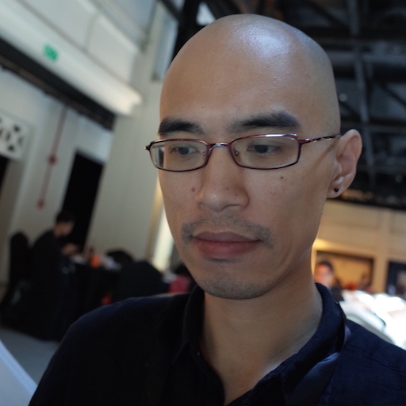
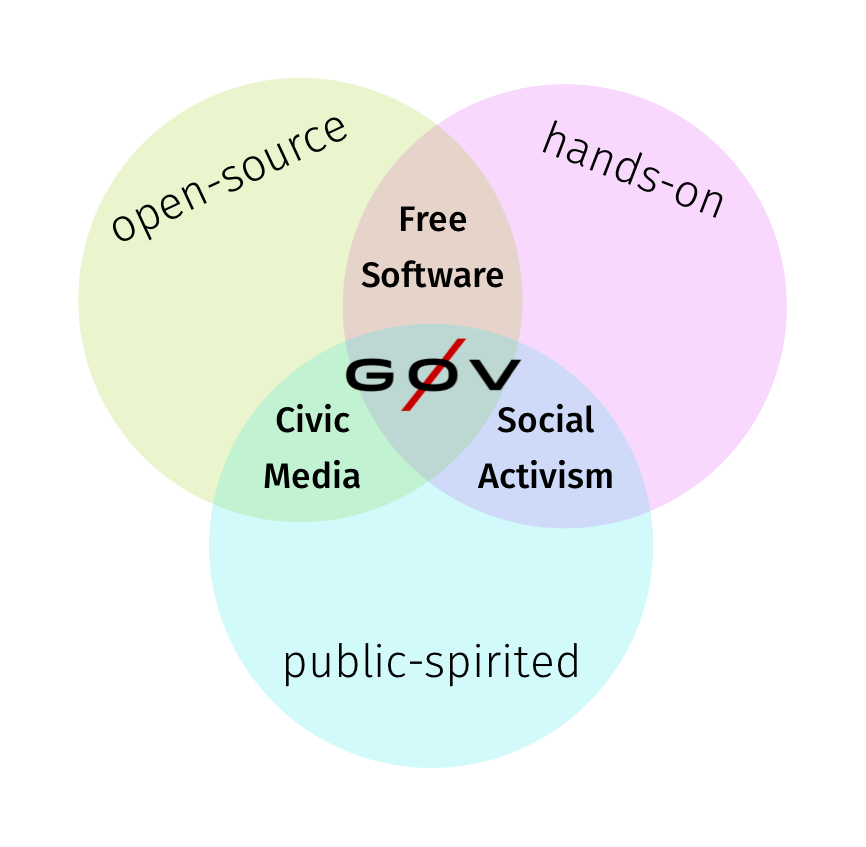
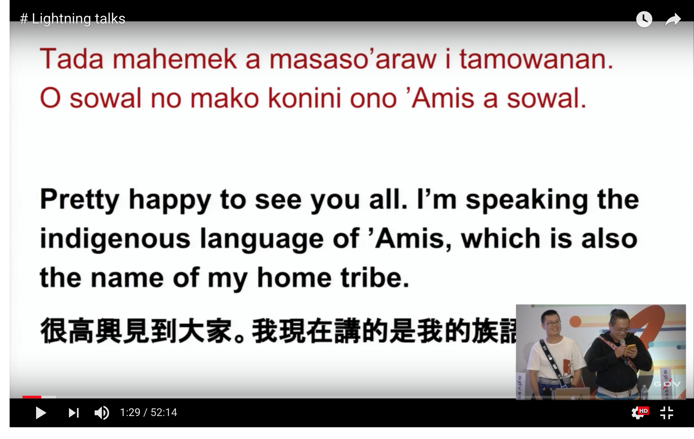

# g0v summit & jothon

Sharing our experiences at Korea OGP network

[TOC]

---

## About me

* Pomin Wu @[pm5](https://twitter.com/pm5)
* I do [mathematics](https://arxiv.org/search/math?query=Wu%2C+Pomin&searchtype=author&abstracts=show&order=-announced_date_first&size=50) and [programming](https://github.com/pm5).
* Worked in NGO/NPOs and startups
* Active in [g0v.tw](https://g0v.tw) and [OpenStreetMap](https://osm.org) since 2013

---

## Slides online

---

## What is g0v?

---

## What is g0v?

Source: <https://g0v.tw/en-US/about.html>

---

## Ideas behind g0v

I'm here to talk about g0v, but no to represent g0v, because:

* nobody represents g0v
* ask not why nobody is doing something, because you are that nobody
* everyone can represent her own view of g0v

---

## See it for yourself

Join us:

* Invite yourself to our ~4000 people Slack (with a `#general-kr` channel for Korean speakers): <https://join.g0v.tw/>
* If you are traveling to Taiwan, come to our [bi-monthly hackathon](https://hack.g0v.tw/) at Taipei.  The next one will be at December 8, 2018.

---

## But what exactly do you do/produce?

---

Language

moedict

iTaigi

'AMIS moedict

---

Easy access to government information

Budget

Weather

Voting guide

National treasure

Campaign Finance Crowdsourcing

Open data advocates

---

Self-helps

Hackfoldr

Cofacts

g0v Air Quality Monitor

Blood donation information https://g0v.github.io/color/#blood

---

## Some lists of projects

* g0v selected projects: <https://g0v.github.io/projects/>
* g0v grants: <https://grants.g0v.tw/>
* g0v projects from registry: <https://g0v.tw/en-US/project-from-registry.html>

---

## g0v summit

---

* [2014](https://summit.g0v.tw/2014/), [2016](https://summit.g0v.tw/2016/), [2018](https://summit.g0v.tw/2018/)
* 2014: 2 days
  - Open Parliament
  - Participatory Democracy
  - Education
  - Civic Technologies
  - Sunflower Movement
  - Open Data and the Environment
  - Age of Collaboration
  - New Faces of Activism
* 2016, 2 days
  - Organizing
  - Reimplementation
  - Open culture experiments
  - Open government
  - Intersectoral
  - Disasters
  - Pollution
* 2018, 3 days
  - Workshops
  - Money
  - Truth
  - News
  - Community building
  - Democracy reimagined
  - Cross-disciplins
  - Private-public partnership

---

1. We run by >= 100 volunteers each time.
2. We have more and more people each time.
3. We have Korean speakers each time!

---

Personal view: We have shifted our focus from

* ..."how to get started / what have we achived" in 2014
* ...to "how do we work with other domains" in 2016
* ... to "why didn't it work / what are the lessons learned" in 2018

---

## What we tried to do this year

As part of the programming committee in 2018 and programming task force in 2016, I think we have (aside from actually have a summit) been trying to focus on: 

* honesty
* not only "good news"
* self-criticism: work condition, actual impact, political reality, etc.
* community-centered

---

English-Mandarin interpreters and [collaboration notes](https://g0v.hackmd.io/c/summit18/%2FAJoegfXqSDm6o1rndW_O_A)

---

[Unconf](https://beta.hackfoldr.org/g0v-Summit-2018-unconf)

---

two sets of interpreters for deaf people

---

support as much as we can to Asia and fellow practitioners

---

communities in R0, Audrey in R2

---

I would not say that we are "inclusive".  We do value inclusiveness, but we trying to be as inclusive as we could within our limits.

These are tho joint work of all [our staffs](https://summit.g0v.tw/2018/staff)

---

[Lightning talk - 'Amis moedict Team](https://youtu.be/whdLxsMv4XQ?t=52)

---

## how did we organize g0v summit

---

Roughly speaking:

1. Someone started by "digging a hole".  She or he usually become the director/chair of the summit.
2. Leaders of various "task forces", head of programming committee were inquired/picked by the director. 
3. Each of the task force leaders would then find their own staff.  [This year's staff](https://summit.g0v.tw/2018/staff).

---

The preparation started one year ago at November 2017.

---

Each of the task forces would usually choose their own governance model.  Some could be more centralised, or some staff would have complete control over a subject.

We try to allow spaces for different governance model. 多種組織方式能夠各自生長的地方.

---

## jothon

---

Culture

---
