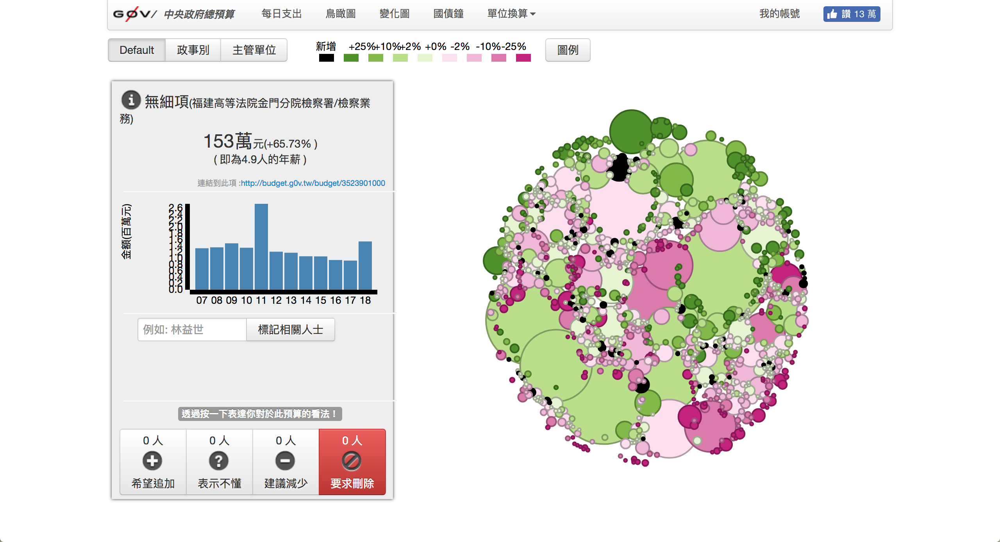
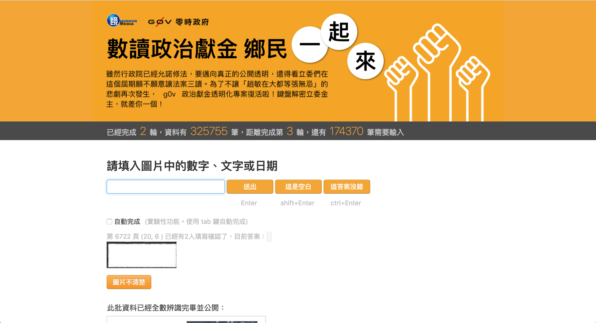
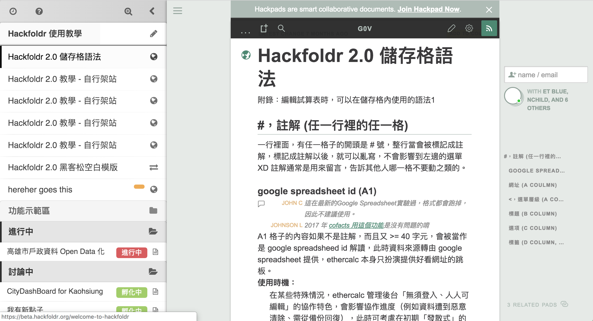

# g0v summit & jothon

Sharing our experiences at Korea OGP network

[TOC]

---

## About me

* Pomin Wu @[pm5](https://twitter.com/pm5)
* I do [mathematics](https://arxiv.org/search/math?query=Wu%2C+Pomin&searchtype=author&abstracts=show&order=-announced_date_first&size=50) and [programming](https://github.com/pm5).
* Worked in NGO/NPOs and startups
* Active in [g0v.tw](https://g0v.tw) and [OpenStreetMap](https://osm.org) since 2013

---

## Slides online

---

## What is g0v?

---

## What is g0v?

Source: <https://g0v.tw/en-US/about.html>

---

Let me demonstrate the values by starting a "[talking about g0v in OGP Networking Day](https://hackmd.io/OkKtw4ygTue3Flr9b83FYg?view#)" project.

---

## Ideas behind g0v

I'm here to talk about g0v, but no to represent g0v, because:

* nobody represents g0v
* ask not why nobody is doing something, because you are that nobody
* everyone can represent her own view of g0v

---

## What actually happend?

1. I was invited to give this talk ("dug a hole for me.")
2. I accepted (I "jumped into the hole" and became the "owner of the hole.")
3. I started collaboration by announcing my project and ask around for helps.
4. I get down to work and finish to talk.

---

Actually, it did not go as smoothly as it seems.

---

## See it for yourself

Join us:

* Invite yourself to our ~4000 people Slack (with a `#general-kr` channel for Korean speakers): <https://join.g0v.tw/>
* If you are traveling to Taiwan, come to our [bi-monthly hackathon](https://hack.g0v.tw/) at Taipei.  The next one will be at December 8, 2018.

---

## But what exactly do you do/produce?

---

Language

---

Easy access to government information

---

Self-helps

---

## Some lists of projects

* g0v selected projects: <https://g0v.github.io/projects/>
* g0v grants: <https://grants.g0v.tw/>
* g0v projects from registry: <https://g0v.tw/en-US/project-from-registry.html>

---

## g0v summit

---

---

## Numbers by year

* [2014](https://summit.g0v.tw/2014/): 2 days, 28 sessions, 45 speakers
* [2016](https://summit.g0v.tw/2016/): 2 days, 47 sessions, 50 speakers
* [2018](https://summit.g0v.tw/2018/): 3 days, 62 sessions, 91 speakers

---

## Some observations

Our slogans:

* [2014](https://summit.g0v.tw/2014/): "Write a program, change the society."
* [2016](https://summit.g0v.tw/2016/): "Tear down the government, rebuild it in place."
* [2018](https://summit.g0v.tw/2018/): "It's open.  What then?"

---

## Shifting our focus

Personally, I think the focus has shifted from

* ..."how to get started / showing what we have got so far" in 2014
* ...to "let's discuss how we work with others" in 2016
* ... to "why didn't it work / what are the lessons learned" in 2018

---

I think the programming committee and task force this year has tried to build an agenda that is: 

* **Honest**: we have more sessions this year talking about "what doesn't work and why", "who's been left out", about if the project made actual impact (often no).
* **Critical**: we have sessions about working conditions, gender, political conditions, etc.  We find speakers who are willing to *ask are things actually changed?* * Is it temporary or is it a more permanent change?*
* **Community-centered**: we reserved the main conference room for community projects, and added a Bird-of-a-Feature gatherings besides the existing Unconference.

---

## Language barrier

* English-Mandarin interpreters  and [collaboration notes](https://g0v.hackmd.io/c/summit18/%2FAJoegfXqSDm6o1rndW_O_A) since 2014.
* Two sets of interpreters for deaf people.
  

---

## Community-centered

* We tried to be as inclusive as we could within our limits.
* **Bootstrapping** and **funding**: these things are crucial but are hard to form the right team with the right people.

---

## Working conditions

* These are the joint work of all [our staffs](https://summit.g0v.tw/2018/staff), all volunteers.
* It has been putting too much stress on many of them.

---

## Representativeness

* 

---

[Lightning talk - 'Amis moedict Team](https://youtu.be/whdLxsMv4XQ?t=52)

---

The preparation started one year ago at November 2017.

---

## jothon

---

Culture

---
